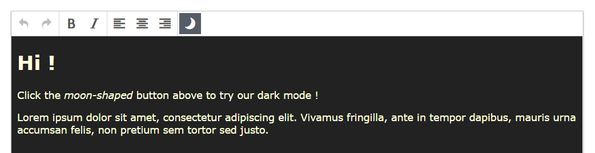

# 👍 TinyMCE Plugin Sample 🌞

## A minimal "dark-mode" plugin for TinyMCE 4.x

This demo plugin adds a button to toogle a very minimal dark-mode.

**See it in action** at <https://jimetevenard.github.io/TinyMCE-Plugin-Sample/>

This plugin is meant to learn how a TinyMCE plugin works.  
See [darkmode.js](darkmode.js) file

See also [the full TinyMCE reference](https://www.tiny.cloud/docs-4x/api/tinymce/tinymce.editor/)

Enjoy !

